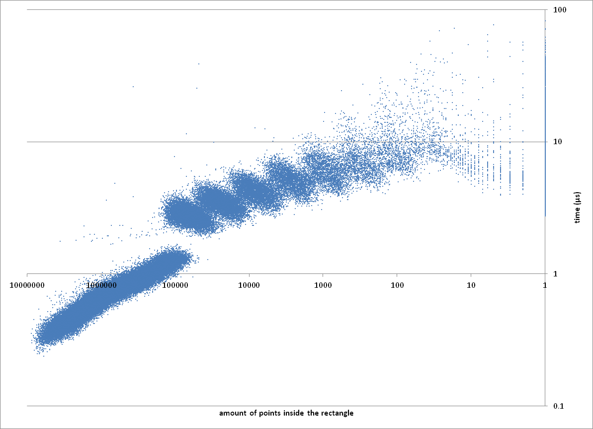

# Whats this?

My submission for Churchill Navigation's programming challange: http://churchillnavigation.com/challenge/. I got the first place quite early in the challange and held it quite long. Final results are still unknown.

The problem description is:
 - You are given an array with 10.000.000 points (`float` x, `float` y, `int32_t` rank, `int8_t` id).
 - You are given a rectangle, return the 20 points inside that rectangle with the lowest rank.
 - do this as fast as possible while keeping the memory requirements below 512MB. Only the query time is counted

# My solution

My program runs 2 different algorithms, first i will describe how each algorithm works, then i will describe how i have linked them together. I shall refer to these algorithms as 'linear scan' and 'mipmap'

# Linear scan

The linear scan algorithm is extremely simple:
 - sort all points by their rank.
 - do a linear scan through the points, checking if it is inside a given rect.
 - when we've found 20 points, return.

This could be implemented as simple as:

```c++
size_t linear_search(Rect rect, Point *points, size_t n_points, Point *out, size_t n_out_points)
{
	size_t n = 0;
	for(size_t i = 0; i < n_points; i++) {
		if (is_inside(rect, points[i])) {
			out[n++] = points[i];
			if (n == n_points)
				break;
		}
	}
	return n;
}
```

But this is not optimal because we're only using 8/13th of each cache line and the implementation of `is_inside` has a lot of potential for branch mispredictions. A more efficient approach would be to use SOA (structure of array) and SSE intrinsics:

```c++
size_t linear_scan(Rect rect, Point* points, float *y_points, float *x_points, size_t n_points, Point* out, size_t n_out_points)
{
    __m256 rect_lx = _mm256_broadcast_ss(&rect.lx);
    __m256 rect_hx = _mm256_broadcast_ss(&rect.hx);
    __m256 rect_ly = _mm256_broadcast_ss(&rect.ly);
    __m256 rect_hy = _mm256_broadcast_ss(&rect.hy);

    point_index n = 0;
    for(point_index i = 0; i < AVX_COUNT; i+=8) {
        __m256 x = _mm256_load_ps(m_x_coord.data() + i);
        __m256 y = _mm256_load_ps(m_y_coord.data() + i);

        __m256 x_in = _mm256_and_ps(_mm256_cmp_ps(rect_lx, x, _CMP_LE_OQ),
                                    _mm256_cmp_ps(rect_hx, x, _CMP_GE_OQ));
        __m256 y_in = _mm256_and_ps(_mm256_cmp_ps(rect_ly, y, _CMP_LE_OQ),
                                    _mm256_cmp_ps(rect_hy, y, _CMP_GE_OQ));

        if (!_mm256_testz_ps(x_in, y_in), 0)
        {
            __m256i mask = _mm256_castps_si256(_mm256_and_ps(x_in, y_in));
            if (_mm256_extract_epi32(mask, 0)) {out_points[n++] = m_points[i+0]; if (n==count) return count;}
            if (_mm256_extract_epi32(mask, 1)) {out_points[n++] = m_points[i+1]; if (n==count) return count;}
            if (_mm256_extract_epi32(mask, 2)) {out_points[n++] = m_points[i+2]; if (n==count) return count;}
            if (_mm256_extract_epi32(mask, 3)) {out_points[n++] = m_points[i+3]; if (n==count) return count;}
            if (_mm256_extract_epi32(mask, 4)) {out_points[n++] = m_points[i+4]; if (n==count) return count;}
            if (_mm256_extract_epi32(mask, 5)) {out_points[n++] = m_points[i+5]; if (n==count) return count;}
            if (_mm256_extract_epi32(mask, 6)) {out_points[n++] = m_points[i+6]; if (n==count) return count;}
            if (_mm256_extract_epi32(mask, 7)) {out_points[n++] = m_points[i+7]; if (n==count) return count;}
        }
    }
    return n;
}
```

For the uninitiated, `__m256` is an data type that contains 8 floats in a single register, usually called `XMM` (128 bits, SSE), `YMM` (256 bits, AVX) or vector register. We can use a single branch to compare 8 points for validity with respect to the rectangle. Note that the above code only works if both y_points and x_points are aligned to an 32-byte boundary and n_points is an multiple of 8. `_mm256_load_ps` crashes on unaligned loads. (which is likely what you want, we don't want unaligned loads in speed-critical code).

As an possible optimization, swap out `_mm256_extract_epi32` with `_mm256_movemask_epi8`. This requires an `AVX2` instruction set, which my computer does not support. `_mm256_extract_epi32` is no real intrinsic, but may compile to 2 separate instructions.

# Mipmaps

An mipmap is an technique often used in computer graphics in which the same texture is stored multiple times in different resolutions.

I shall refer to 'mipmap 0' or 'lowest level mipmap' as the smallest mipmap, and 'top level mipmap' as the largest mipmap. Our lowest level mipmap contains around 3000 points, with each subsequent level containing 3 times as many points. These numbers were chosen after much experimentation.

| level | size | bytes |
| --- | --- | --- |
| 0 | 3050 | 0.07 MiB |
| 1 | 9150 | 0.21 MiB |
| 2 | 27450 | 0.63 MiB |
| 3 | 82350 | 1.88 MiB |
| 4 | 247050 | 5.65 MiB |
| 5 | 741150 | 16.96 MiB |
| 6 | 2223450 | 50.89 MiB |
| 7 | 6670350 (actually 6668302) | 152.62 MiB |

Mipmap level 0 stores the 3050 points with the lowest rank. Mipmap level 1 contains the 9150 points with the lowest rank which where not already included in level 0, and so on.
We store each mipmap level twice, once sorted by the X dimension, once sorted by the Y dimension. We use the same SOA technique as before.

```c++
struct x_mipmap {
	float *x_coords;	// sorted
	float *y_coords;	// not sorted
	int32_t *index;
	size_t size;
}

struct y_mipmap {
	float *x_coords;	// not sorted
	float *y_coords;	// sorted
	int32_t *index;
	size_t size;
}
```

When we are testing for points inside the rectangle, we do an binary search in both `x_mipmap` and `y_mipmap` to find the amount of points with valid X (in case of `x_mipmap`) or Y coordinate (in case of `y_mipmap`). Then we select either the X or Y mipmap to scan though. If we selected the `x_mipmap`, we only have to compare the Y coordinate of the points (which can be done extremely efficiently with SSE). The inverse holds true for `y_mipmap`. The indices of points that fall into the rectangle are inserted into an max heap. At a low level, this algorithm boils down to a binary search in an sorted array followed by a linear scan, this is extremely cache-friendly.

My max heap is an simple implementation that uses `std::push_heap` and `std::pop_heap`. 

After profiling this code i've found out that the binary search takes a relatively high chuck of the execution time. Can we reduce the amount of binary searches we have to do somehow? It turns out we can with fractional cascading trees, but this would not fit in our memory requirements. I've ended up creating an mapping table that maps each mimap level n to n+1. With this mapping table we can calculate the approximate position in mipmap level n+1, we don't have to do an binary search over all data, but only over an small range of data.

# Putting it all together 

simple: get the 2048 lowest-ranked points and run the linear scan algorithm. If we have not found 20 points yet, run the mipmap algorithm. These 2 algorithms complement each other nicely, linear scan is a best-case if the rectangle is large, mipmap is a best-case when the rectangle is small.

The ugly case is when this happens:

Assuming 10GB/s memory bandwidth and 10m points, the worst-case running time of this algorithm is 2ms. 

Plotting the time the algorithm took for a given rectangle relative to the total amount of points in the rectangle leads to interesting plots:

the long area on the left side is the linear scan algorithm. This area contains around 65% of the inputs. Towards the left we see 7 different blobs, corresponding the 7 mipmap layers. 

# What didn't work

K-D trees. The cache misses completely destroy it. Actually i wanted to implement an cone tracing-like data structure, but i settled on K-D trees instead. Cone tracing is an algorithm used in 3D games for ambient occlusion and uses an data structure that resembes a quad tree.

In order to utilize cache lines as efficient as possible, my K-D tree stored few points in each node. This was faster than an normal K-D tree but always slower than the combined linear scan + mipmap algorithm. If the rectangle is small, you're likely to search deep and K-D tree will perform poorly in comparsion to mipmaps. If the rectangle is large, the linear scan will be orders of magnitude faster. My K-D tree was by no means optimal, and could've been improved a lot.

Threading is another thing that did not work. Some of the later mipmap levels take between 10-60µs to process. I did a quick test and the overhead to submit job to another thread and retrieve it's result is around 0.5µs. This means that above a work size of 1µs it should be faster to use worker threads. After i've implemented this it turned out the speedup was neglectable, i require more time to figure out why there is such an large difference between my testcase and the actual implementation. The code is nearly identical.

# Lessons learned

I think the main take away is that caches are important. SSE intrinsics help in this aspect, as they force you to think and arrange the data as efficient as possible. This is not news to me, but i will be paying more attention to it in the future.

# Compilers

I've found gcc 4.9.1 to be around 2% faster than MSVC 2014 and around 6% faster than 2012. The setup phase is almost 50% faster with gcc than with either version of MSVC, i have not spent time figuring out why. The setup phase involves a few memcpy's and a few ten million binary searches.

# Reading the code

| which | what |
| ----- | ----- |
| binary_search | data structure that holds an single mipmap level |
| rank_heap.h | max-heap implementation |
| solution.h cpp | the actual algorithm |

# License

This project is licenced under an MIT license.


Copyright (c) 2015 Stefan Dessens


Permission is hereby granted, free of charge, to any person obtaining a copy of this software and associated documentation files (the "Software"), to deal in the Software without restriction, including without limitation the rights to use, copy, modify, merge, publish, distribute, sublicense, and/or sell copies of the Software, and to permit persons to whom the Software is furnished to do so, subject to the following conditions:

The above copyright notice and this permission notice shall be included in all copies or substantial portions of the Software.

THE SOFTWARE IS PROVIDED "AS IS", WITHOUT WARRANTY OF ANY KIND, EXPRESS OR IMPLIED, INCLUDING BUT NOT LIMITED TO THE WARRANTIES OF MERCHANTABILITY, FITNESS FOR A PARTICULAR PURPOSE AND NONINFRINGEMENT. IN NO EVENT SHALL THE AUTHORS OR COPYRIGHT HOLDERS BE LIABLE FOR ANY CLAIM, DAMAGES OR OTHER LIABILITY, WHETHER IN AN ACTION OF CONTRACT, TORT OR OTHERWISE, ARISING FROM, OUT OF OR IN CONNECTION WITH THE SOFTWARE OR THE USE OR OTHER DEALINGS IN THE SOFTWARE.

